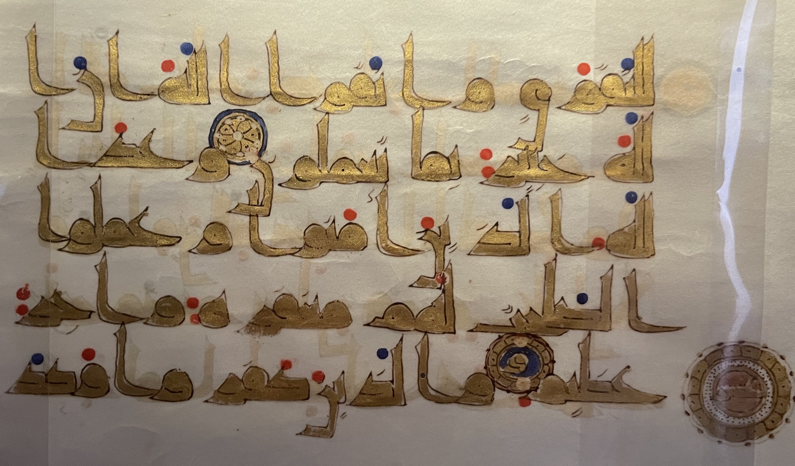
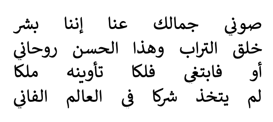
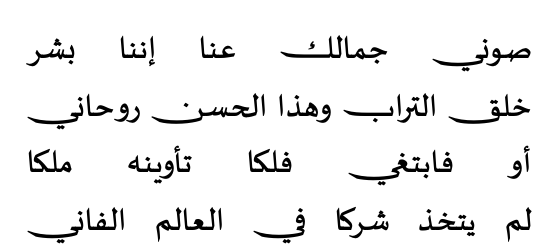
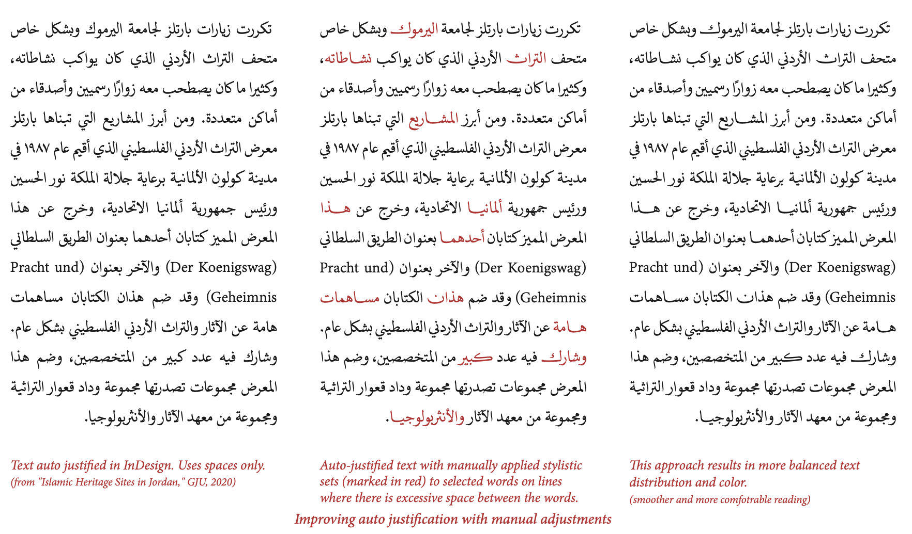
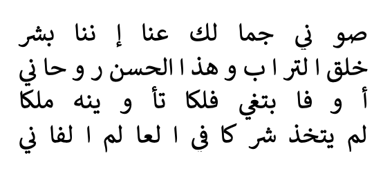

+++
title = "Thoughts on Arabic Justification"

+++

For the tl;dr, skip to [Priority](#priority-list). This article is a follow up to [this one](@/thoughts/2023-04-02-Linebreaking/index.md).

## Background Reading 
Here are some links that you might want to look at:
- [Deficiencies of Handling Arabic Script in OpenType. Aida Sakkal and Mamoun Sakkal. Tech Talks 2021](https://www.youtube.com/watch?v=Ai4dgLpFMx8). Mamoun Sakkal is a rather well known Arabic type designer. The video goes over the practical problems of justification in detail.
- [On Arabic justitifcation part 2 by Titus Nemeth](https://research.reading.ac.uk/typoarabic/on-arabic-justification-part-2-software-implementations/). (Look at parts 1 and 3 as well).
- [About Digital Khatt.](https://digitalkhatt.org/about) Real world (as it gets) examples of some of the ideas of Arabic justification. This is a public github project you can find [here](https://github.com/DigitalKhatt).
- [Making JSTF better by Simon Cozens on TypeDrawers](https://typedrawers.com/discussion/3465/making-jstf-better)
- [Discussion at HarfBuzz Github - Support for jalt feature and target length](https://github.com/harfbuzz/harfbuzz/discussions/3252) I will save you a click: "HarfBuzz currently does not implement justification, because it's a hard problem, and is under-specified in OpenType." Here is a [follow up discussion: API for buffer target length](https://github.com/harfbuzz/harfbuzz/pull/3259) Useful context by all parties.
- More general and high level: [Approaches to Line Breaking, W3C](https://www.w3.org/International/articles/typography/linebreak.en) and [Approaches to full justification](https://www.w3.org/International/articles/typography/justification).

## Intro

Justification is a nasty and difficult problem. When justifying over sufficiently long lines, the [Knuth-Plass algorithm](Linebreaking.md) is more than enough. However, when the lines are narrow, for example in a newspaper column, there just arent enough words in a line to make small changes to the space between them unnoticeable, and you need to take more drastic measures.

For English, and Latin (and Cyrillic?) script-based languages in general, the usual solution is [hyphenation](https://en.wikipedia.org/wiki/Hyphen#Justification_and_line-wrapping). This does not apply to every script. For example, the Japanese script have their own [justification algorithm](https://www.w3.org/TR/jlreq/?lang=en) that does not "just" add spaces between characters. Other scripts have their own rules going on.

## Arabic Hyphenation?

In Arabic, they *used to* hyphenate words around 1400 years ago. They, sadly, no longer do that, as it would make things so much simpler. In the following image, you can see the letter ا at the end (left) of the first line, and the word fragment لله at the start (right) of the second. And again at the end of the second and start of third. (Consecutive hyphenated lines - oh no). The break is not across syllabic boundaries, as an English speakers would expect, but between connected clusters.



If you know anything about the Arabic script, you know two things: 1. It is written from right to left, and 2. in words, the letters are connected, but not all of them! (Letters are almost never connected *across* words.) So for example in the word ديمقراطية, meaning Democracy, well it is one word, but there are four "clusters". Like I said, we do not "hyphenate" (I am using the term loosely here as there are no actual hyphens) between those any more, but it is an important concept to keep in mind.

Which brings us back to the original problem statemnt: if the line width is so small that merely adjusting the spaces between words would be unseemly, what do you do? I am going to abuse my version of Microsoft Word a bit for this post. Here is an image of line of poetry justified using space stretching only. (Considering it is poetry, breaking words across lines is not even an option).



The lines are by [Ahmed Shawqi](https://en.wikipedia.org/wiki/Ahmed_Shawqi):

<par dir = "rtl">

صوني جمالك عنا إننا بشر       
خلق التراب وهذا الحسن روحاني       
أو فابتغي فلكا تأوينه ملكا       
لم يتخذ شركا في العالم الفاني.

</par>

I have a few unhinged ideas. But let's talk about the usual approach first.

## Kashidas

If you have watched Mamoun Sakkal's video. linked above, on the technical limitations of OpenType when it comes to Arabic script, you would have noticed he spends a lot of the video talking about "Tatweel", or what is sometimes called by its Persian name, Kashida.

[Kashida is a character on all Arabic keyboards](https://www.compart.com/en/unicode/U+0640). It does not have a meaning, by itself or by others, and it is merely decorartive. It is a typographinc (typesetting?) trick, that takes advantage of Arabic's connected nature. For an Arabic reader (and this applies to literally every language that uses the Arabic script), there is literally no difference between جمل and جـــــــمـــــــــل. The second one simply looks longer. You can probably see where this is going.

The kashidas method basically inserts these characters betwen the individual letters of clusters.


The main problem with this is that it is *dumb*. So dumb it is useless. You can see how it adds some kashidas after بشر on the first line. (Reminder: "after" means on the left.) This can be fixed, and this is probably a MS Word problem, but the other problem is a bit more subtle, and it is not clear with Calibri (as it was probably designed with this behavior in mind). Let us try with a different font by the same designer, Sakkal Majalla.


You can see it in the second line, in the words التراب and الحسن, and in the third line in فابتغي, a bit more subtly. The font uses (and abuses) an OpenType feature called Contextual Alternates, which basically means some letters look different when followed by specific letters, and it is all over the place in every half-decent Arabic font online.

The software, for whatever reason, *does not* call the shaper (HarfBuzz and the like) again after inserting the kashidas, and in fonts that use cursive shaping and do not sit on the baseline, you end up with this: (Noto Nastaliq Urdu)


This is not a display typeface being misused by the way. It is meant for texts. If you want to see more dramatic failures, try the fonts [Gulzar](https://gulzarfont.org) and [Aref Ruqaa](https://fonts.google.com/specimen/Aref+Ruqaa?query=aref) and set Word's justification setting to "Justify Low". This is **not** a failure of the fonts. This is a failure of the justification engine.

The way type designers protect their fonts from this fate is by making the Kashida unicode character be 0-width (aka does nothing). The font [Sakkal Kitab](https://fonts.ilovetypography.com/fonts/sakkal-design/sakkal-kitab) (which costs $120 I do not have), does not even permit you to put Kashidas manually between any two letters. Only in specific places, and only manually (or by use of stylistic sets). You can try it yourself on the webpage by copying parts of the poem above and inserting the kashida in random places. 

Note that I am not saying that inserting Kashidas should never ever happen. I am saying it should never happen naively, and the engine must reshape the text after inserting Kashidas, or it will fail in spectacular ways seen above.

If you still want to insert Kashidas, the algorithm is simple enough: inser the kashidas before the letters with the `fina` shape, or before the `medi` shape. Complications would perhaps arise from trying to find out which glyphs, or HarfBuzz clusters, are final or medial (and a simple look up dictionary would not do if you want to support more than the Araic language. There are other scripts that connect too, btw: Ad'lam, N'ku, Syriac to name a couple).

The [Sakkal Kitab PDF Specimen](https://d3qx8f8l5aa3yc.cloudfront.net/images/sakkal_kitab_features.pdf) is a very nice brief read regarding justification.

Speaking of which:

## OpenType Features

OpenType has a feature *specifically* for justification. It is not very well supported, and in fact in mainstream software only InDesign makes use of it. It is called Justification Alternates, or `jalt` for short.`jalt`s, in theory, can make the word longer *or* shorter, tho I have not come across examples that make them shorter. I do not have InDesign, but Sakkal Majalla helpfully has a stylistic set that does what `jalt` does. This how the font looks normally:


This is how it looks with Stylistic Set 3 (or for this exercise, `jalt`s):



You might reasonably point out that this does not solve the problem, and the text still has a lot of ugly spaces between the words. You would be forgetting an important fact here: I am intentionally abusing the software by forcing fully justified short lines. Poetry is a legit use case for justification, but it is an extreme case nonetheless. You can see a more real world example in Sakkal Kitab's Specimen, linked above. Here is a handy screenshot for you:


The real issue with `jalt` and font-driven justification, if you would call it that, is that apparently it is very underspecified, and the support, if it exists at all, is inconsistent.

You can see in the previous screenshot how in the paragraph with `jalt`, InDesign turns it on for *every word*, and not only when needed. This, honestly, defeats the purpose. The text looks way too loose. The manual justification sample, on the right, is more measured when using the justification alternates. (Although because InDesign does not actually let you access `jalt` directly, it uses stylistic sets instead.) The following page is perhaps more illustrative (the middle and right columns are identical by the way):



You can see here that the justification alternate, while not used *sparingly*, they are only used when the spaces would otherwise be too loose. You might also notice that the typesetter (who I can only assume is Sakkal himself) never applied it for two consecutive words, and never more than two times in a line. The choice of *which* words to stretch is probably arbitrary, based on personal taste.

I believe this process can reasonably be automated.

### Using `jalt`s in a practical manner

First of all you need whether the font has `jalt`s or not. You could even ask the user if they would like to use any other font features for justification purposes, and if they'd have a priority.

For example, if the user specifies using `ss16`, `ss17`, `ss18`, `ss19`, and `ss20` for justification, in this order, use those. If they don't, use `jalt` if available.

Pseuorustcode time! I will be adjusting on the `build_line()` function from the [linebreaking](@/thoughts/2023-04-02-Linebreaking/index.md) article.

```rust
fn build_line(input: ShapedText,
              start_bp: u64,
              end_bp: u64,
              desired_width: f64) -> Result<Line, Error> {

    // same as before
    let b_and_g = input.slice_betweeen(start_bp, end_bp);
    let sum_boxes = b_and_g.filter(|g| !g.is_whitespace())
                           .map(|g| g.horizontal_advance())
                           .sum();
    let count_glue = b_and_g.filter(|g| g.is_whitespace())
                            .count();
    let pft_space = input.ideal_space_width();
    let min_space = input.min_space_width();
    let max_space = input.max_space_width();

    // The math for errors being saved here for later
    let stretched_base = sum_boxes + (count_glue * max_space);
    let cmprsd_bse = sum_boxes + (count_glue * min_space);

    // this didn't change either, assuming all jalts increase width
    if cmprsd_bse > desired_width {
        return Error::LineTooTight;
    }

    // new stuff !!
    // first we need to split the input into words. Each "word"
    // is a tuple of the breakpoints before and after. This is
    // probably too naive but let's go with it.
    let word_list = (start_bp..end_bp).map(|i| (i, i + 1));

    // Now some insanity: we need to shuffle the words. The reason
    // for that is we do not want to apply jalt to two consecutive
    // words: it is ugly. Now only our code looks ugly.
    let word_list = word_list
        .clone()
        .step_by(3)
        .chain(word_list.clone().skip(1).step_by(3))
        .chain(word_list.clone().skip(2).step_by(3))
        .rev(); 

    // We assume our ShapedText type has a "reshape_with" method
    // This method takes the ShapedInput slice we have, well, 
    // reshapes it, and gives it the result.

    // Cool Rust feature: Labeled Blocks
    let words_to_change: Vec<(u64, u64)> = 'outer: {

        // First we try changing one word
        for (word_start, word_end) in word_list {
            let word = input.slice_betweeen(word_start, word_end);
            let reshaped = word.reshape_with("jalt");

            let delta = reshaped.width() - word.width();

            if delta + stretched_base < desired_width {
                // instead of returning with error
                continue;
            } else if delta + cmprsd_bse > desired_width {
                // what if the jalts are _too_ long?
                continue;
            } else {
                // assign the found word
                break 'outer vec![(word_start, word_end)];
            }
       }

       // Then we try changing two words
        for (fst_start, fst_end) in word_list {
            for (snd_start, snd_end) in word_list {
                if fst_start == snd_start { continue; }

                let fst_word = input.slice_betweeen(fst_start, fst_end);
                let fst_reshaped = fst_word.reshape_with("jalt");

                let snd_word = input.slice_betweeen(snd_start, snd_end);
                let snd_reshaped = snd_word.reshape_with("jalt");

                let delta = fst_reshaped.width() - fst_word.width()
                            + snd_reshaped.width() - snd_word.width();

                if (delta + stretched_base < desired_width) 
                   || (delta + cmprsd_bse > desired_width) {
                    continue; 
                } else {
                    // assign the found words
                    break 'outer vec![(fst_start, fst_end), (snd_start, snd_end)];
                }
            }
        }

        // Then we try 3 .. this can probably be written to be better

        // NOW we return with Error. This exits the build_line() function
        return Error::LineTooLoose;
    }

    // Sort our words to change based on their order.
    let words_to_change = words_to_change.sort_by_key(|(x,_)| x);

    // now we rebuild our boxes list with our new found vector,
    // and also shadow (redefine) the variables b_and_g and 
    // sum_boxes, from the start of the build_line() function.
    let mut idx = 0;
    let mut segments: Vec<(u64, u64, bool)> = Vec::new();
    for (s, e) in words_to_change {
        if s != idx {
            segments.push((idx, s, false));
            segments.push((s, e, true));
        } else {
            segments.push((idx, e, true));
        }
        idx = e;
    }
    if idx != end_bp {
        segments.push((idx, end_bp, false));
    }

    let b_and_g = 
        segments.map(|(s, e, c)| {
            if c {
                input.slice_betweeen(s, e).reshape_with("jalt")
            } else {
                input.slice_betweeen(s, e)
            }
        }).reduce(|a, b| a + b); // concatenating the whole thing

    let sum_boxes = b_and_g.filter(|g| !g.is_whitespace())
                           .map(|g| g.horizontal_advance())
                           .sum();
    
    // Rest is the same. perhaps add a penalty if you get to 3 jalts
    let true_width = sum_boxes + (count_glue * pft_space);
    let actual_space_width =
        (desired_width - true_width)/count_glue + pft_space;
    let line_cost = Math::square(desired_width - true_width);
    
    //...
    // Here is where you place a bunch of code laying out the
    // glyphs (sorry boxes) into a Line object, with the 
    // actual_space_width you found, and return it!
    //...

    return Ok(final_line);
}

```

phew! This took me a few days to express properly, and I hope the intent is clear. I am sure if you actually implement this in a code base a lot of bugs will come up, nut hey!

This code could be even expanded to take a bunch of OpenType features ( evne specified by the user) and apply them in order of priority. Let's keep this as an exercise for the reader.

## Variable Fonts

This is probably the best solution. Sadly, it is not (yet?) common in most fonts. Definitely not the ones shipping by default in operating systems.

For the uninitiated, [here is a useful Google Fonts primer on what variable fonts are and how they work](https://fonts.google.com/knowledge/introducing_type/introducing_variable_fonts). [This is an article by John Hudson of Tiro Typeworks](https://medium.com/variable-fonts/https-medium-com-tiro-introducing-opentype-variable-fonts-12ba6cd2369). The most useful part of Variable Fonts, imo, is that font designers are free to implement any variable axis they want. The spec has five axis with a .. well .. specified behaviour, but designers are not restricted by them. The five registered axis are Weight `wght`, Width `wdth`, Optical size `opsz`, Italic `ital`, and Slant `slnt`. But how about [Temprature](https://codepen.io/mandymichael/pen/pxXNbr)? [Stretch](https://www.29lt.com/product/29lt-okaso/)? [Serif](https://www.type-together.com/belarius-font)? [The possibilities are practically endless](https://v-fonts.com/tags/C5).

For justification, one can either use the Width axis (as [Sultan al-Maqtari does with his font Sultan Plain](hhttps://sites.google.com/view/sultanfonts/naskh-font/plain)), or use what is called a `GEXT`, a Glyph Extension axis. This [article by Simon Cozens](https://simoncozens.github.io/more-on-newbreak/) has an example for an Armenian font. The simple idea is that you break the lines with a greedy algorithm (what Knuth calls first-fit), and then simply .. increase the width, or the glyph extension, of your lines to fit in the desired space.

This gives back autonomy to the font designer: the line stretchs the way they see fit. It is simpler to program for software makers than the hodgepodge of selecting `jalt`s above. The spaces are all at the ideal space. The text all looks neat. [Here are a few demos of how this might look in practice](https://github.com/jmsole/gext-demos). There are no downsides!!

Well the main downside is that it is not widely available, and there is no generally agreed on axis for justification use. (That last point is why Cozens is suggesting the `GEXT` axis.) The other (minor) downside is is that the axis are *not* guaranteed to be evenly distributed. If you measure the line's width at axis point 0, and measure it again at axis point 100, there is zero guarantee that the line width at axis point 50 would be their average. Also it is all a bit wonky in browsers. But who cares about browsers?

From a naive point of view, the typestter should do the following:
1. Check if the font is variable, 
2. Check if it has a `GEXT` axis, (and if not use the `wdth` axis or just ask the user!)
3. Use the greedy algorithm to break lines.
4. Stretch each line until they fit!!

This might still fail, by the way, as not every line is guaranteed to be filled (as not every character us guaranteed to be affected by every axis.) But it is hell a lot better than inserting ugly straight line Kashidas.

## Spacing Clusters

I promised unhingedness. How about this: 



Instead of spacing between words, Arabic text can increase the spacing between clusters!! Nobody does it this way but it would be cool. Do not actually do that.

## Priority list

Before setting up rules for justification, the typesetter first and foremost should ask the user which method to use! The user know the font they're using and they know which method they prefer. If they want to justify their text by flexing spaces (aka Knuth-Plass), let them. If they want to use the *weight* axis instead of the *width* axis, sure. If they want to specify specfic OpenType features to use for justification (like using a number of Stylistic sets or Swashes), then that's what they want.

It is perhaps the best way to go on about this, honestly. Unless they ask for Kashidas, then you crash the software.

If I were to create a priority system of justification, I would set it as follows:

1. If the font is [variable](#variable-fonts), check if it has an axis specified for justification. Could be `GEXT` or `JSTF` or w/e (or ask the user!).
2. If it does, use it. If it does not, check for [`jalt`](#opentype-features)s.
3. If they exist, use them. If they do not, well now you have to use [Kashidas](#kashidas). Insert those between letters as needed. But not any letters!! There are rules!!
4. And for God's sake reshape the text after inserting them Kashidas. It is what the shaper is there for.
